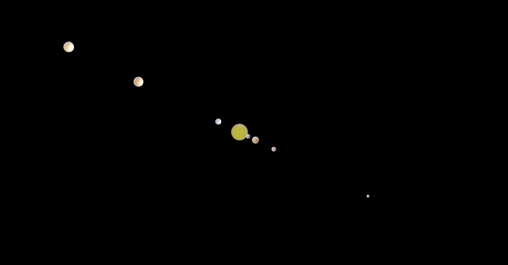

# Planetary Simulation with Manim

This repository contains a Python-based 3D planetary simulation using the [Manim](https://www.manim.community/) animation library. The simulation models gravitational interactions between celestial bodies (e.g., the Sun, Earth, and Mars) and animates their motion in a visually engaging 3D environment.

  

---

## Table of Contents

1. [Overview](#overview)
2. [Features](#features)
3. [Dependencies](#dependencies)
4. [Installation](#installation)
5. [Usage](#usage)
6. [Customization](#customization)

---

## Overview

The simulation calculates the gravitational forces between planets using Newton's law of gravitation and updates their positions, velocities, and accelerations iteratively. The resulting motion is animated using Manim's 3D rendering capabilities, providing an interactive and educational visualization of orbital mechanics.

Key features include:
- Realistic physics calculations for gravitational interactions.
- Dynamic camera movement and zoom effects to enhance the visualization.
- Adjustable parameters for time steps, planet properties, and animation speed.

---

## Features

- **Physics-Based Simulation**:
  - Models gravitational forces between multiple celestial bodies.
  - Updates positions, velocities, and accelerations based on physical laws.

- **Dynamic Camera Control**:
  - Smoothly rotates and zooms the camera to provide different perspectives of the simulation.

- **Scalable Design**:
  - Supports adding more planets or celestial bodies with minimal changes to the code.

- **Lighting Effects**:
  - Simulates a light source originating from the Sun, creating realistic shading effects.

---

## Dependencies

To run this simulation, you need the following:

1. **Python** (version 3.8 or higher)
2. **Manim**:
   - Install the latest version of Manim Community Edition:
     ```bash
     pip install manim
     ```
   - Alternatively, follow the installation instructions on the [official Manim documentation](https://docs.manim.community/en/stable/installation.html).
3. **NumPy**:
   - Required for numerical calculations. Install via:
     ```bash
     pip install numpy
     ```

---

## Installation

1. Clone this repository:
   ```bash
   git clone https://github.com/your-username/planetary-simulation.git
   cd planetary-simulation
   ```
   Install the required dependencies:
   ```bash
   pip install manim numpy
   ```
   Verify that Manim is installed correctly by running:
   ```bash
   manim --help
   ```


## Usage
-----

1.  Navigate to the directory containing the simulation script:

    bash
    ```
    cd path/to/simulation
    ```
2.  Run the simulation using Manim:

    bash
    ```
    manim -pql planetary_simulation.py PlanetarySimulation
    ```
    -   `-p`: Plays the animation after rendering.
    -   `-q`: Sets the quality (`l` for low, `m` for medium, `h` for high).
    -   Replace `PlanetarySimulation` with the name of the scene class if you modify it.
3.  The rendered video will open automatically after rendering.


## Customization
-------------

You can customize the simulation to suit your needs:

### 1\. Add More Planets

-   Extend the `planets` list with additional celestial bodies:

    python

    ```
    jupiter = Planet(mass=1.898e27, position=[7.785e11, 0, 0], velocity=[0, 13070, 0])

    planets.append(jupiter)

    colors.append(GREEN) # Add a color for Jupiter

    radii.append(0.3) # Add a radius for Jupiter
    ```

### 2\. Adjust Simulation Parameters

-   Modify the `DT` (time step) or the number of iterations to control the simulation's duration and speed:

    python

    ```

    DT = 50 # Smaller time step for finer updates

    for _ in range(400): # Simulate more steps

    ```


### 3\. Modify Rendering Settings

-   Change the frame rate or resolution in the `config` settings:

    python

    ```

    config.frame_rate = 60 # Set frame rate to 60 fps

    config.pixel_height = 1080 # Set resolution height

    config.pixel_width = 1920 # Set resolution width

    ```

* * * * *


## Acknowledgments
---------------

-   Thanks to the [Manim Community](https://www.manim.community/) for creating and maintaining this powerful animation library.
-   Inspired by physics simulations and educational tools for understanding orbital mechanics.
